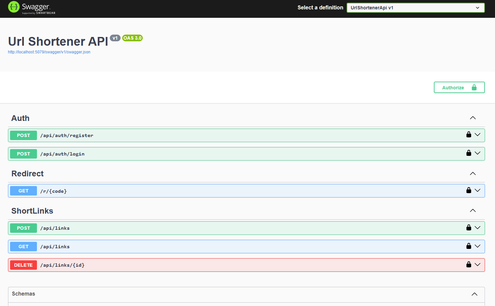

# 🔗 URL Shortener API (.NET)

A clean and secure **URL Shortener REST API** built with **ASP.NET Core**.  
This project focuses on core backend fundamentals like authentication, database access, and clean architecture.



---

## ✨ Features

- JWT Authentication (Register / Login)
- Create short URLs
- Public redirect using short code
- Click count tracking
- User-specific links
- Secure delete (ownership-based)
- Global error handling middleware

---

## 🛠 Tech Stack

- ASP.NET Core Web API (.NET 9)
- Entity Framework Core
- PostgreSQL / SQL Server
- JWT Authentication
- BCrypt password hashing
- Swagger (OpenAPI)

---

## 📂 Project Structure

```bash
├── Program.cs
├── Migrations/
├── src/
│ ├── Controllers/
│ ├── Services/
│ ├── Interfaces/
│ ├── Middleware/
│ ├── Entities/
│ ├── DTOs/
│ └── Data/
└── Properties/
```


## 🔐 Authentication Flow

- Users register and login using email & password
- Passwords are securely hashed using BCrypt
- JWT token is issued on login
- Protected endpoints require Bearer token
- Users can manage only their own short links

---

## 📌 API Endpoints (Overview)

POST /api/auth/register
POST /api/auth/login
POST /api/links
GET /api/links
GET /{shortCode}
DELETE /api/links/{id}

# 🚀 How to Run Locally

### 1. Clone the repository

```bash
git clone <repository-url>
cd <project-directory>
```

### 2. Set Database Connection String
Update the appsettings.json file with your local database credentials:

```bash
{
  "ConnectionStrings": {
    "DefaultConnection": "Server=YOUR_SERVER;Database=YOUR_DB;Trusted_Connection=True;MultipleActiveResultSets=true"
  }
}
```


### 3. Run Migrations
Ensure your database is up to date by running:

```bash
dotnet ef database update
```

### 4. Start the API

```bash
dotnet run
```

### 5. Open Swagger
Once the application is running, navigate to: https://localhost:{port}/swagger

# 👤 Author
Anand